# Kode 架构文档

## 目录
- [1. 项目概述](#1-项目概述)
- [2. 核心组件](#2-核心组件)
- [3. 核心流程详解](#3-核心流程详解)
  - [3.1 启动态流程](#31-启动态流程)
  - [3.2 运行态流程](#32-运行态流程)
- [4. 组件交互机制](#4-组件交互机制)
- [5. 扩展点设计](#5-扩展点设计)
- [6. 数据流与状态管理](#6-数据流与状态管理)
- [7. 安全与权限系统](#7-安全与权限系统)

---

## 1. 项目概述

Kode 是一个基于 AI 的终端助手，支持多模型协作、代码理解与编辑、命令执行以及工作流自动化。项目采用模块化架构设计，具有高度的可扩展性和灵活性。

### 技术栈
- **运行时**: Node.js ≥ 20.18.1
- **开发工具**: Bun (开发环境)
- **UI 框架**: Ink (React for CLI)
- **语言**: TypeScript
- **AI 提供商**: 支持 Anthropic、OpenAI、Gemini、Mistral、DeepSeek 等 20+ 模型

### 核心特性
- 🤖 多模型智能协作
- 🛠️ 可扩展工具系统
- 🔌 MCP (Model Context Protocol) 集成
- 👤 智能代理（Agent）系统
- 🔒 细粒度权限控制
- 💾 上下文感知能力

---

## 2. 核心组件

### 2.1 入口层 (Entrypoints)

#### CLI 入口 (`src/entrypoints/cli.tsx`)
- **职责**: 处理命令行参数、初始化系统、启动 REPL
- **关键功能**:
  - 参数解析与验证
  - 配置系统初始化
  - 运行模式选择（交互式/非交互式）
  - 安全模式控制（`--safe` 标志）
  - Agent 配置热重载

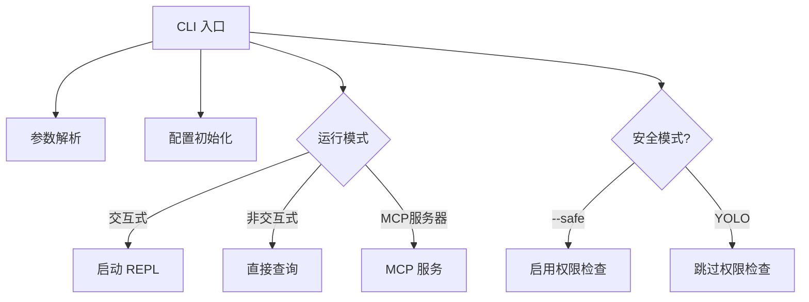

#### MCP 服务入口 (`src/entrypoints/mcp.ts`)
- **职责**: 启动 Model Context Protocol 服务器
- **功能**: 允许 Kode 作为 MCP 服务器供其他 AI 工具调用

---

### 2.2 用户交互层 (UI Layer)

#### REPL 主界面 (`src/screens/REPL.tsx`)
- **职责**: 主交互循环，管理会话状态
- **核心状态**:
  - `messages`: 消息历史
  - `isLoading`: 加载状态
  - `abortController`: 请求控制器
  - `toolJSX`: 工具渲染内容
  - `inputMode`: 输入模式 (prompt/bash/koding)

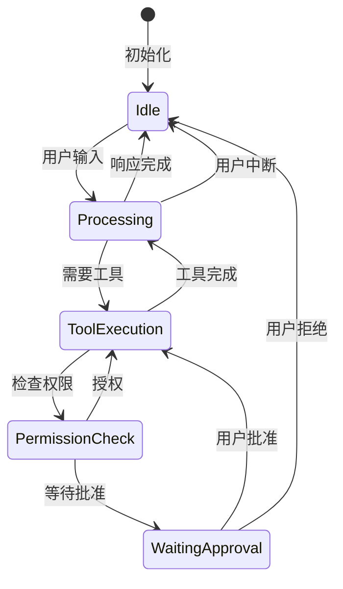

#### 组件系统 (`src/components/`)
- **Message**: 消息渲染
- **PromptInput**: 智能输入组件（支持 @ 补全）
- **PermissionRequest**: 权限请求对话框
- **ModelSelector**: 模型选择器
- **Logo**: 品牌展示（含版本更新提示）

---

### 2.3 AI 模型层 (Model Layer)

#### 模型管理器 (`src/utils/model.ts`)

```typescript
// 核心概念
export type ModelProfile = {
  name: string              // 用户友好名称
  provider: ProviderType    // 提供商类型
  modelName: string         // 模型标识符
  baseURL?: string          // 自定义端点
  apiKey: string            // API 密钥
  maxTokens: number         // 输出令牌限制
  contextLength: number     // 上下文窗口大小
  isActive: boolean         // 是否启用
}

export type ModelPointers = {
  main: string      // 主对话模型
  task: string      // 任务执行模型
  reasoning: string // 推理模型
  quick: string     // 快速响应模型
}
```

#### 模型适配器工厂 (`src/services/modelAdapterFactory.ts`)
- **职责**: 根据模型配置创建对应的 API 适配器
- **支持的 API 架构**:
  - **Responses API**: GPT-5、o3 等高级模型
  - **Chat Completions API**: 传统聊天补全接口

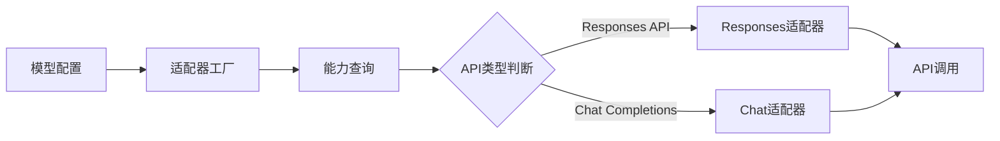

#### Claude 服务 (`src/services/claude.ts`)
- **核心函数**:
  - `queryLLM()`: 统一查询接口
  - `queryModel()`: 底层模型调用
  - `formatSystemPromptWithContext()`: 系统提示词构建

---

### 2.4 工具系统 (Tool System)

#### 工具接口 (`src/Tool.ts`)

```typescript
export interface Tool<TInput, TOutput> {
  name: string
  description?: () => Promise<string>
  inputSchema: z.ZodObject<any>
  prompt: (options?: { safeMode?: boolean }) => Promise<string>
  
  // 工具特性
  isEnabled: () => Promise<boolean>
  isReadOnly: () => boolean
  isConcurrencySafe: () => boolean
  needsPermissions: (input?: TInput) => boolean
  
  // 验证与执行
  validateInput?: (input: TInput, context?: ToolUseContext) => Promise<ValidationResult>
  call: (input: TInput, context: ToolUseContext) => AsyncGenerator<...>
  
  // 渲染
  renderToolUseMessage: (input: TInput, options: { verbose: boolean }) => string
  renderResultForAssistant: (output: TOutput) => string | any[]
}
```

#### 内置工具类型

| 工具类别 | 工具名称 | 只读性 | 并发安全 | 主要功能 |
|---------|---------|-------|---------|---------|
| **文件操作** | FileReadTool | ✅ | ✅ | 读取文件内容 |
|  | FileEditTool | ❌ | ❌ | 编辑文件 |
|  | FileWriteTool | ❌ | ❌ | 创建文件 |
|  | MultiEditTool | ❌ | ❌ | 批量编辑 |
| **代码搜索** | GlobTool | ✅ | ✅ | 文件名模式匹配 |
|  | GrepTool | ✅ | ✅ | 正则表达式搜索 |
|  | LSTool | ✅ | ✅ | 列出目录内容 |
| **系统命令** | BashTool | ❌ | ❌ | 执行 Shell 命令 |
| **AI 协作** | TaskTool | ❌ | ❌ | 创建子任务代理 |
|  | AskExpertModelTool | ❌ | ✅ | 咨询专家模型 |
|  | ThinkTool | ✅ | ✅ | 深度推理 |
| **网络工具** | WebSearchTool | ✅ | ✅ | 网络搜索 |
|  | URLFetcherTool | ✅ | ✅ | 抓取网页内容 |
| **记忆系统** | MemoryReadTool | ✅ | ✅ | 读取记忆 |
|  | MemoryWriteTool | ❌ | ❌ | 写入记忆 |
| **MCP集成** | MCPTool | 动态 | 动态 | MCP 服务器工具 |

#### 工具加载机制 (`src/tools.ts`)
```typescript
export const getTools = async (enableArchitect?: boolean): Promise<Tool[]> => {
  const tools = [...getAllTools(), ...(await getMCPTools())]
  
  if (enableArchitect) {
    tools.push(ArchitectTool)
  }
  
  const isEnabled = await Promise.all(tools.map(tool => tool.isEnabled()))
  return tools.filter((_, i) => isEnabled[i])
}
```

---

### 2.5 MCP 集成 (MCP Integration)

#### MCP 客户端管理 (`src/services/mcpClient.ts`)
- **职责**: 管理 MCP 服务器连接和工具发现
- **支持的传输协议**:
  - **stdio**: 标准输入输出通信
  - **SSE**: Server-Sent Events

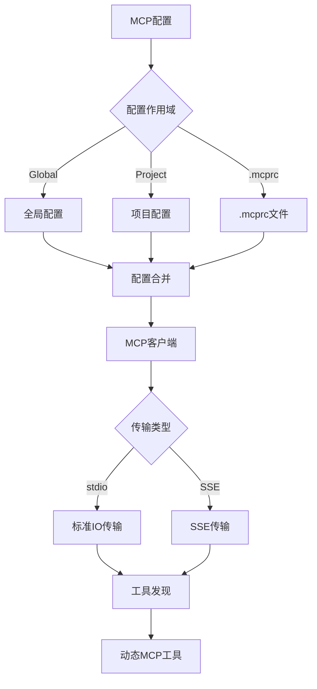

#### MCP 服务器审批机制
- **安全审批流程**: 未批准的 MCP 服务器需要用户明确授权
- **配置持久化**: 批准/拒绝记录存储在项目配置中

---

### 2.6 命令系统 (Command System)

#### 命令类型 (`src/commands.ts`)

```typescript
type PromptCommand = {
  type: 'prompt'
  progressMessage: string
  getPromptForCommand(args: string): Promise<MessageParam[]>
}

type LocalCommand = {
  type: 'local'
  call(args: string, context: {...}): Promise<string>
}

type LocalJSXCommand = {
  type: 'local-jsx'
  call(onDone: (result?: string) => void, context: {...}): Promise<React.ReactNode>
}
```

#### 内置命令列表

| 命令 | 类型 | 功能描述 |
|-----|------|---------|
| `/help` | local-jsx | 显示帮助信息 |
| `/model` | local-jsx | 模型配置管理 |
| `/config` | local-jsx | 配置编辑器 |
| `/cost` | local | 显示成本统计 |
| `/clear` | local | 清除会话历史 |
| `/init` | local | 初始化项目上下文 |
| `/agents` | local-jsx | 管理智能代理 |
| `/mcp` | local | MCP 服务器管理 |
| `/doctor` | local-jsx | 系统诊断 |

#### 自定义命令 (`src/services/customCommands.ts`)
- **加载机制**: 从 `.kode/` 目录加载自定义命令
- **热重载**: 支持运行时更新

---

### 2.7 权限系统 (Permission System)

#### 权限上下文 (`src/permissions.ts`)

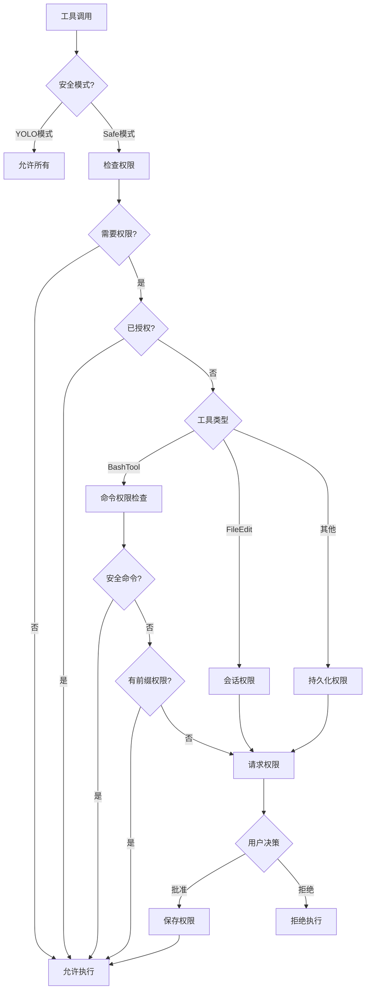

#### 安全命令白名单
```typescript
const SAFE_COMMANDS = new Set([
  'git status', 'git diff', 'git log', 'git branch',
  'pwd', 'tree', 'date', 'which'
])
```

#### Bash 命令权限粒度
- **完全匹配**: `bash(git status)`
- **前缀匹配**: `bash(git:*)` - 允许所有 git 命令
- **全局授权**: `bash` - 允许所有命令

---

### 2.8 配置系统 (Configuration System)

#### 配置层级

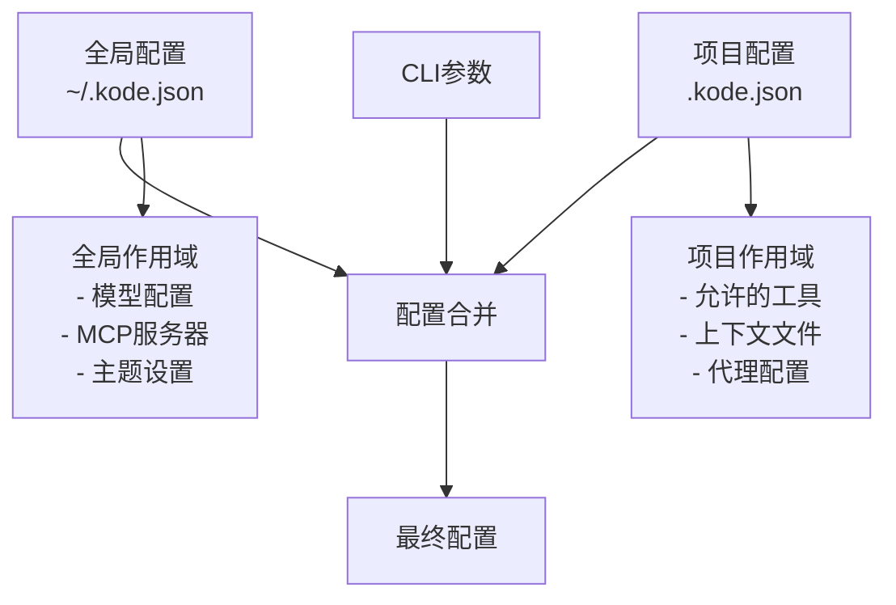

#### 全局配置 (`GlobalConfig`)
```typescript
{
  modelProfiles: ModelProfile[],      // 模型配置列表
  modelPointers: ModelPointers,        // 模型指针
  mcpServers: Record<string, McpServerConfig>,
  theme: ThemeNames,                   // 主题
  verbose: boolean,                    // 详细模式
  proxy?: string,                      // 代理设置
  stream: boolean,                     // 流式输出
  customApiKeyResponses: {             // API密钥审批
    approved?: string[],
    rejected?: string[]
  }
}
```

#### 项目配置 (`ProjectConfig`)
```typescript
{
  allowedTools: string[],              // 已授权工具列表
  context: Record<string, string>,     // 上下文键值对
  contextFiles?: string[],             // 上下文文件
  mcpServers?: Record<string, McpServerConfig>,
  enableArchitectTool?: boolean,       // 启用架构工具
  hasTrustDialogAccepted?: boolean,    // 信任对话框确认
  approvedMcprcServers?: string[],     // 已批准的.mcprc服务器
  rejectedMcprcServers?: string[]      // 已拒绝的.mcprc服务器
}
```

---

### 2.9 消息处理与查询 (Message Processing & Query)

#### 查询管线 (`src/query.ts`)

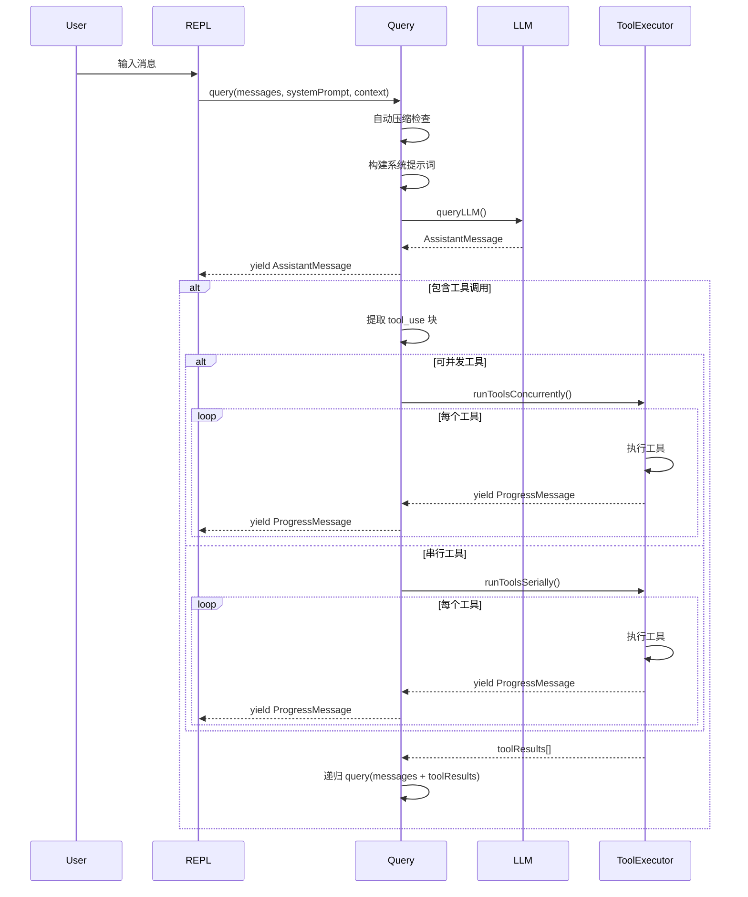

#### 工具执行控制器 (`src/utils/toolExecutionController.ts`)
- **并发控制**: 只读工具可并发执行
- **进度报告**: 通过 `ProgressMessage` 实时反馈
- **错误处理**: 捕获工具执行异常并包装为错误消息

---

### 2.10 智能代理系统 (Agent System)

#### 代理加载器 (`src/utils/agentLoader.ts`)
- **配置文件**: `AGENTS.md` 或 `.agents/` 目录
- **热重载**: 文件变更自动重载代理配置
- **标准支持**: 兼容 OpenAI AGENTS.md 标准

#### TaskTool - 子代理创建
```typescript
// 使用示例
"@run-agent-test-writer 为这个模块创建全面的测试"

// 内部机制
TaskTool.call(input, context) {
  // 1. 创建子代理会话
  // 2. 使用 task 指针指定的模型
  // 3. 隔离执行上下文
  // 4. 返回子代理结果
}
```

---

## 3. 核心流程详解

### 3.1 启动态流程

启动态流程描述了从执行 `kode` 命令到系统完成初始化的完整过程。

#### 执行入口

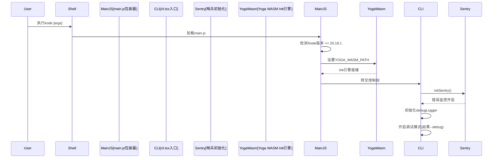

**关键文件**:
- `main.js`: npm 包入口点，负责环境预检
- `src/entrypoints/cli.tsx`: 主入口，包含 `main()` 函数

### 3.1 启动流程

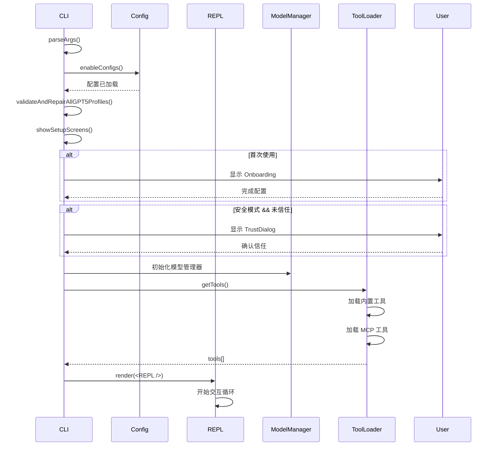


---

#### 配置系统初始化

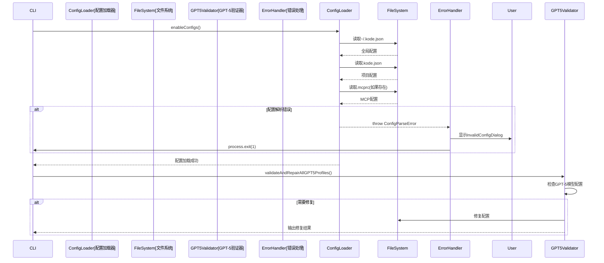

**配置层级**:
1. **全局配置** (`~/.kode.json`): 模型配置、主题、MCP服务器
2. **项目配置** (`.kode.json`): 工具权限、上下文文件、本地MCP
3. **MCP配置** (`.mcprc`): 项目级MCP服务器

---

#### 设置屏幕流程

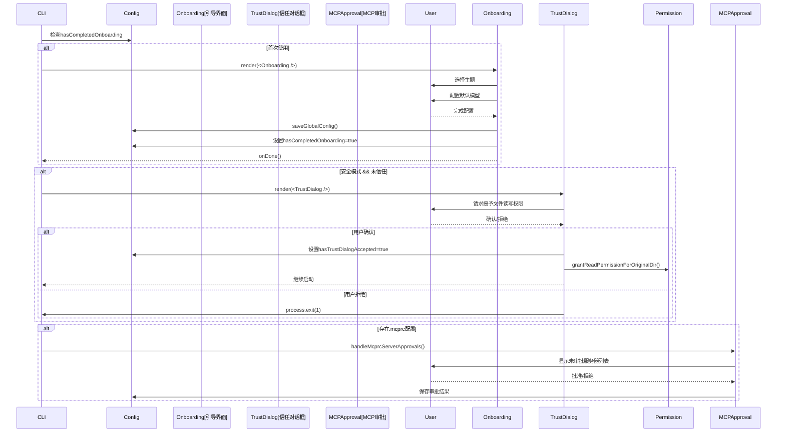

**关键点**:
- 引导流程只在首次使用时显示
- 安全模式需要明确的用户授权
- MCP 服务器需要逐个审批

---

#### 系统组件初始化

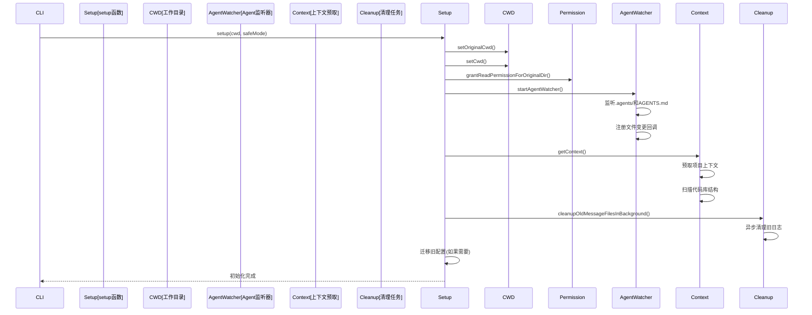

**重要机制**:
- **Agent 热重载**: 自动监听 AGENTS.md 和 `.agents/` 目录变化
- **上下文预取**: 提前加载项目结构信息，减少后续请求延迟
- **后台清理**: 异步清理过期消息文件，不阻塞启动

---

#### 工具与MCP加载

```mermaid
sequenceDiagram
    participant CLI
    participant ToolLoader[getTools()]
    participant BuiltinTools[内置工具]
    participant MCPClient[MCP客户端]
    participant MCPServers[MCP服务器]
    participant ArchitectTool[Architect工具]
    
    CLI->>ToolLoader: getTools(enableArchitect)
    
    ToolLoader->>BuiltinTools: getAllTools()
    BuiltinTools-->>ToolLoader: [
        TaskTool,
        BashTool,
        FileReadTool,
        ...
    ]
    
    par 加载MCP工具
        ToolLoader->>MCPClient: getClients()
        MCPClient->>MCPClient: 读取配置(global+project+.mcprc)
        
        loop 每个MCP服务器
            MCPClient->>MCPServers: connect()
            
            alt stdio传输
                MCPClient->>MCPServers: StdioClientTransport
            else SSE传输
                MCPClient->>MCPServers: SSEClientTransport
            end
            
            MCPServers-->>MCPClient: 连接成功
            MCPClient->>MCPServers: listTools()
            MCPServers-->>MCPClient: tools[]
            MCPClient->>MCPClient: 包装为MCPTool
        end
        
        MCPClient-->>ToolLoader: mcpTools[]
    end
    
    alt enableArchitect
        ToolLoader->>ArchitectTool: 添加ArchitectTool
    end
    
    ToolLoader->>ToolLoader: 过滤禁用的工具
    ToolLoader-->>CLI: 最终工具列表
```

**工具加载逻辑**:
1. 加载所有内置工具
2. 并行连接所有MCP服务器
3. 发现并包装MCP工具
4. 根据配置添加Architect工具
5. 过滤禁用的工具

---

#### REPL渲染与启动

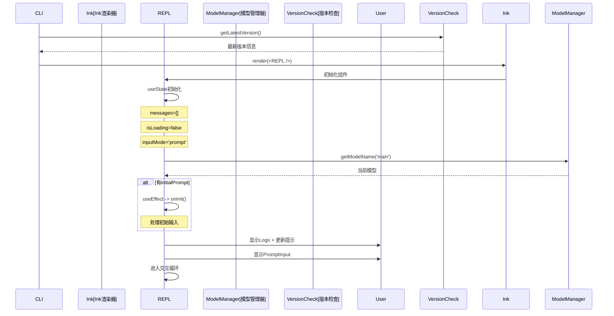

**REPL 初始状态**:
```typescript
const [messages, setMessages] = useState<MessageType[]>(initialMessages ?? [])
const [isLoading, setIsLoading] = useState(false)
const [abortController, setAbortController] = useState<AbortController | null>(null)
const [inputMode, setInputMode] = useState<'bash' | 'prompt' | 'koding'>('prompt')
const [forkNumber, setForkNumber] = useState(0)
const [toolJSX, setToolJSX] = useState<{jsx: ReactNode, shouldHidePromptInput: boolean} | null>(null)
```

---

#### 完整启动流程总结

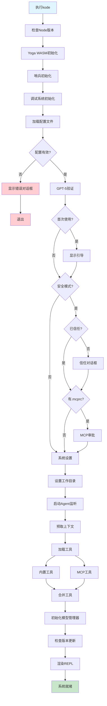

**启动时间分解** (典型值):
- Node/Yoga 初始化: ~50ms
- 配置加载: ~20ms
- 工具加载: ~100ms
- MCP 连接: ~200ms (取决于服务器数量)
- REPL 渲染: ~30ms
- **总计**: ~400-600ms

---

### 3.2 运行态流程

运行态流程描述了系统启动后处理用户输入、调用模型和工具、生成响应的完整交互流程。

#### 用户输入处理

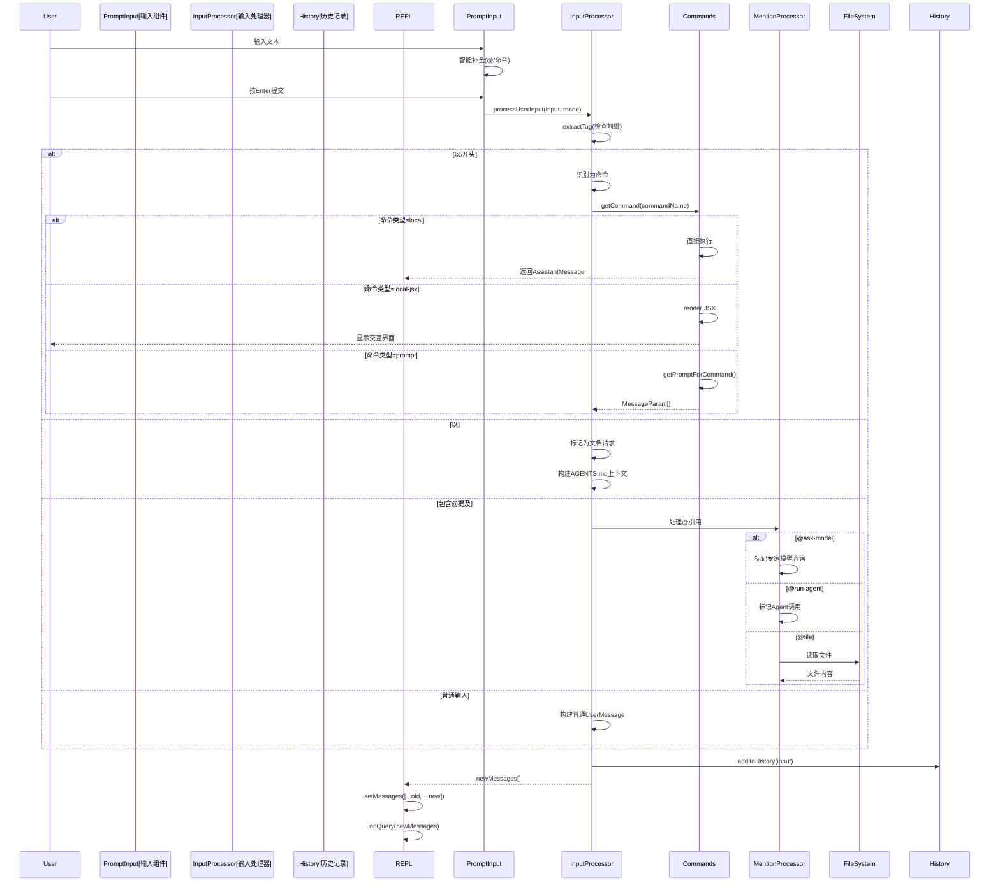

**输入模式**:
- `prompt`: 普通对话模式
- `bash`: Bash 命令模式 (直接执行)
- `koding`: 代码生成模式

---

#### Query 管线 - 核心查询流程

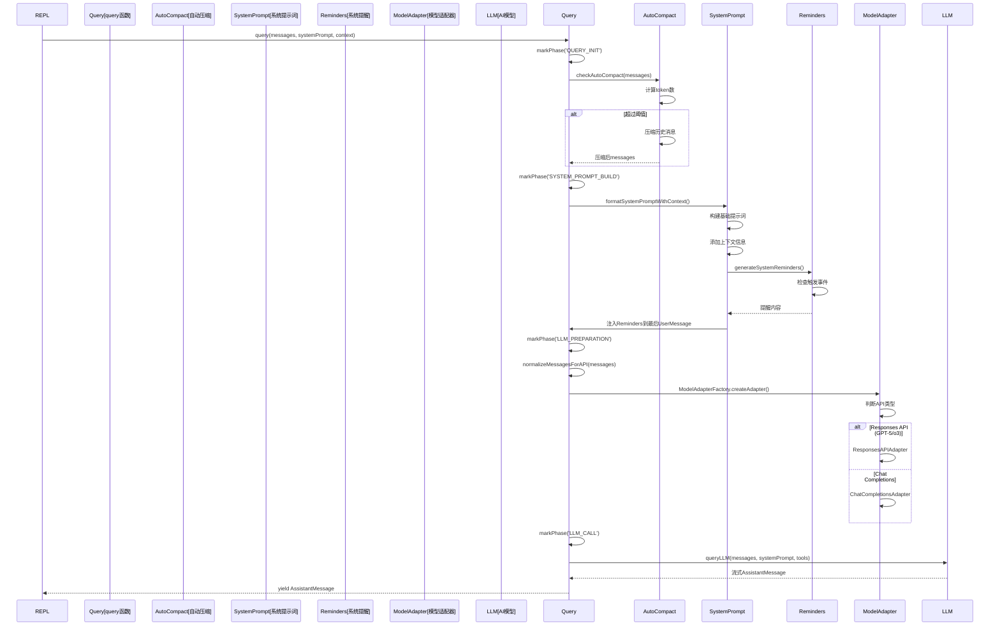

**关键阶段**:
1. `QUERY_INIT`: 初始化，检查自动压缩
2. `SYSTEM_PROMPT_BUILD`: 构建系统提示词
3. `LLM_PREPARATION`: 消息标准化
4. `LLM_CALL`: 调用AI模型
5. `TOOL_EXECUTION`: 工具执行(如果需要)

---

#### 模型响应处理

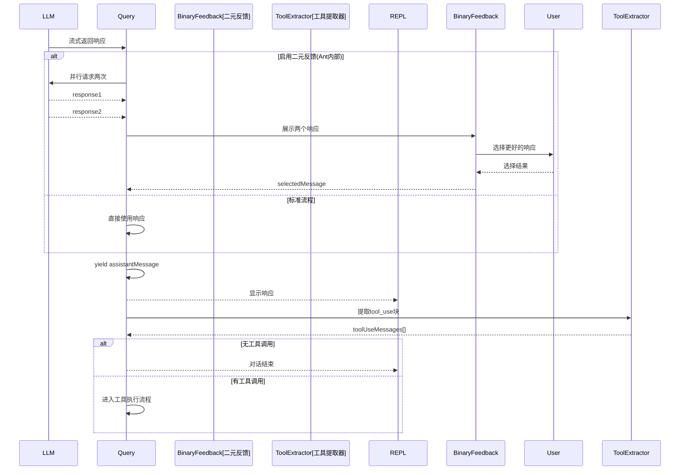

---

#### 工具执行流程

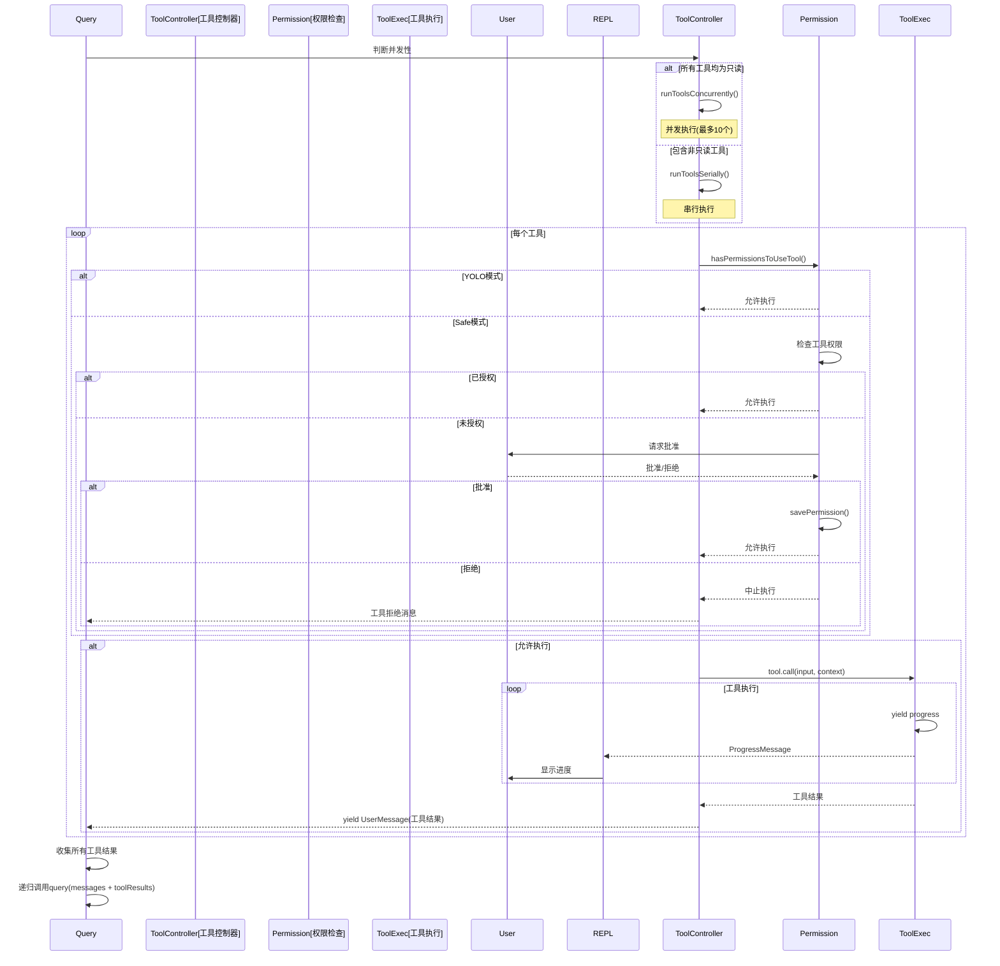

**工具执行特性**:
- **并发控制**: 只读工具可并发，写入工具串行
- **进度反馈**: 通过 `yield` 机制实时显示
- **错误处理**: 捕获异常并包装为错误消息

---

#### 递归Query流程

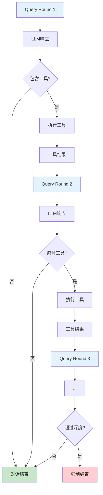

**递归机制**:
```typescript
async function* query(messages, systemPrompt, context, ...) {
  // 1. 调用LLM
  const assistantMessage = await queryLLM(...)
  yield assistantMessage
  
  // 2. 提取工具调用
  const toolUseMessages = extractToolUse(assistantMessage)
  
  if (toolUseMessages.length === 0) {
    return // 结束递归
  }
  
  // 3. 执行工具
  const toolResults = await runTools(toolUseMessages)
  
  // 4. 递归调用，将工具结果作为新的用户消息
  yield* query([...messages, assistantMessage, ...toolResults], ...)
}
```

---

#### 特殊工具流程 - AskExpertModel

```mermaid
sequenceDiagram
    participant MainModel[主模型]
    participant AskExpertTool
    participant ExpertModel[专家模型]
    participant ModelManager
    participant User
    
    MainModel->>MainModel: 决定咨询专家
    MainModel->>AskExpertTool: tool_use(ask_expert_model)
    
    AskExpertTool->>AskExpertTool: 解析目标模型
    AskExpertTool->>ModelManager: 切换到专家模型
    
    AskExpertTool->>ExpertModel: 发送专家查询
    Note over ExpertModel: 使用高级模型<br>(GPT-5, o3, Claude Opus)
    
    ExpertModel-->>AskExpertTool: 专家意见
    
    AskExpertTool->>User: 显示专家响应(可选)
    AskExpertTool->>ModelManager: 切换回主模型
    
    AskExpertTool-->>MainModel: 返回专家意见
    MainModel->>MainModel: 整合专家意见
    MainModel-->>User: 生成最终响应
```

**使用场景**:
```
User: 这个算法的时间复杂度是多少？

Main Model (Claude Sonnet 4): 
  让我咨询GPT-5模型来分析这个复杂的算法...
  [tool_use: ask_expert_model]
  
Expert Model (GPT-5):
  根据深度分析，这个算法的时间复杂度为 O(n log n)...
  
Main Model:
  根据GPT-5的分析，这个算法的复杂度是O(n log n)。具体原因是...
```

---

#### 特殊工具流程 - TaskTool (SubAgent)

```mermaid
sequenceDiagram
    participant MainAgent[主代理]
    participant TaskTool
    participant SubAgent[子代理]
    participant TaskModel[任务模型]
    participant ToolExec[工具执行]
    participant User
    
    MainAgent->>MainAgent: 决定创建子任务
    MainAgent->>TaskTool: tool_use(task_tool)
    
    TaskTool->>TaskTool: 创建隔离上下文
    TaskTool->>SubAgent: 启动子代理会话
    
    SubAgent->>TaskModel: 使用task指针模型
    Note over TaskModel: Qwen Coder, Kimi k2
    
    loop 子代理执行循环
        SubAgent->>TaskModel: 查询
        TaskModel-->>SubAgent: 响应
        
        alt 需要工具
            SubAgent->>ToolExec: 执行工具
            ToolExec-->>SubAgent: 工具结果
        end
        
        SubAgent->>User: 显示进度
    end
    
    SubAgent-->>TaskTool: 子任务结果
    TaskTool-->>MainAgent: 返回结果
    
    MainAgent->>MainAgent: 整合子任务结果
    MainAgent-->>User: 生成最终响应
```

**并行子任务**:
```
User: 重构这三个模块并添加测试

Main Model:
  我将创建三个子代理并行处理:
  [task_tool: 重构module1.ts]
  [task_tool: 重构module2.ts]
  [task_tool: 重构module3.ts]
  
SubAgent 1 (Qwen Coder): 正在重构module1.ts...
SubAgent 2 (Qwen Coder): 正在重构module2.ts...
SubAgent 3 (Qwen Coder): 正在重构module3.ts...

(并发执行，最多10个并发)

Main Model: 所有模块重构完成，现在添加测试...
```

---

#### 完整运行态流程总结

```mermaid
graph TB
    UserInput[用户输入] --> Parse{输入类型}
    
    Parse -->|/command| CheckCmd{命令类型}
    CheckCmd -->|local| ExecLocal[本地执行]
    CheckCmd -->|local-jsx| RenderJSX[JSX渲染]
    CheckCmd -->|prompt| BuildPrompt[构建Prompt]
    
    Parse -->|#doc| DocGen[文档生成]
    Parse -->|@mention| ProcessMention[处理提及]
    Parse -->|普通| BuildUserMsg[构建UserMessage]
    
    BuildPrompt --> Query
    DocGen --> Query
    ProcessMention --> Query
    BuildUserMsg --> Query
    
    Query[Query管线] --> AutoCompact[自动压缩检查]
    AutoCompact --> BuildSysPrompt[构建系统提示词]
    BuildSysPrompt --> NormalizeMsg[消息标准化]
    
    NormalizeMsg --> SelectAdapter{选择适配器}
    SelectAdapter -->|GPT-5| ResponsesAPI[Responses API]
    SelectAdapter -->|其他| ChatAPI[Chat Completions]
    
    ResponsesAPI --> LLMCall[LLM调用]
    ChatAPI --> LLMCall
    
    LLMCall --> StreamResp[流式响应]
    StreamResp --> YieldAssist[显示Assistant消息]
    
    YieldAssist --> ExtractTools[提取工具调用]
    ExtractTools --> HasTools{有工具?}
    
    HasTools -->|否| Done[对话结束]
    HasTools -->|是| CheckConcur{可并发?}
    
    CheckConcur -->|是| ConcurExec[并发执行]
    CheckConcur -->|否| SerialExec[串行执行]
    
    ConcurExec --> PermCheck[权限检查]
    SerialExec --> PermCheck
    
    PermCheck --> SafeMode{Safe模式?}
    SafeMode -->|YOLO| ExecTool[执行工具]
    SafeMode -->|Safe| ReqApproval[请求批准]
    
    ReqApproval --> UserApprove{用户批准?}
    UserApprove -->|是| ExecTool
    UserApprove -->|否| ToolRejected[工具拒绝]
    
    ExecTool --> YieldProgress[显示进度]
    YieldProgress --> ToolResult[工具结果]
    
    ToolResult --> CollectResults[收集所有结果]
    ToolRejected --> CollectResults
    
    CollectResults --> RecursiveQuery[递归Query]
    RecursiveQuery --> Query
    
    ExecLocal --> ShowResult[显示结果]
    RenderJSX --> ShowResult
    Done --> ShowResult
    
    ShowResult --> WaitInput[等待下一次输入]
    
    style UserInput fill:#e1f5ff
    style Done fill:#c8e6c9
    style ShowResult fill:#c8e6c9
    style WaitInput fill:#fff9c4
    style ToolRejected fill:#ffcdd2
```

**时间分解** (典型交互):
1. 输入处理: ~10ms
2. 系统提示词构建: ~20ms
3. LLM 响应时间: 2-10s (取决于模型和复杂度)
4. 工具执行: 100ms-30s (取决于工具类型)
5. 递归查询: 每轮 2-10s

**平均交互周期**: 5-30秒 (包含 1-3 轮工具调用)

---

## 4. 组件交互机制

```mermaid
graph TB
    UserInput[用户输入] --> InputParser{输入解析}
    
    InputParser -->|命令| CommandHandler[命令处理器]
    InputParser -->|文档请求| DocHandler[文档生成]
    InputParser -->|提及| MentionProcessor[提及处理器]
    InputParser -->|普通文本| MessageBuilder[消息构建]
    
    CommandHandler --> LocalExec{命令类型}
    LocalExec -->|本地| LocalCommand[本地执行]
    LocalExec -->|JSX| JSXRender[JSX渲染]
    LocalExec -->|提示词| BuildPrompt[构建提示词]
    
    BuildPrompt --> Query[Query管线]
    MessageBuilder --> Query
    DocHandler --> Query
    
    Query --> LLMCall[LLM调用]
    LLMCall --> Response[AI响应]
    
    Response --> HasToolUse{包含工具调用}
    HasToolUse -->|否| DisplayResponse[显示响应]
    HasToolUse -->|是| PermCheck{权限检查}
    
    PermCheck -->|YOLO| ExecuteTool[执行工具]
    PermCheck -->|Safe| RequestApproval[请求批准]
    RequestApproval --> UserApprove{用户批准}
    UserApprove -->|是| ExecuteTool
    UserApprove -->|否| AbortTool[中止工具]
    
    ExecuteTool --> ToolResult[工具结果]
    ToolResult --> RecursiveQuery[递归Query]
    RecursiveQuery --> LLMCall
    
    AbortTool --> DisplayResponse
```

### 3.3 多模型协作机制

```mermaid
graph TB
    UserRequest[用户请求] --> ModelPointer{模型指针}
    
    ModelPointer -->|main| MainModel[主对话模型<br>Claude Sonnet 4]
    ModelPointer -->|task| TaskModel[任务模型<br>Qwen Coder]
    ModelPointer -->|reasoning| ReasoningModel[推理模型<br>o3]
    ModelPointer -->|quick| QuickModel[快速模型<br>GLM-4.5]
    
    MainModel --> TaskDecision{需要子任务?}
    TaskDecision -->|是| TaskTool[TaskTool调用]
    TaskTool --> SubAgent[创建子代理]
    SubAgent --> TaskModel
    
    MainModel --> ExpertConsult{需要专家意见?}
    ExpertConsult -->|是| AskExpertTool[AskExpertModel]
    AskExpertTool --> ExpertModel[专家模型<br>GPT-5/Claude Opus]
    
    TaskModel --> TaskResult[任务结果]
    ExpertModel --> ExpertOpinion[专家意见]
    
    TaskResult --> Integration[结果整合]
    ExpertOpinion --> Integration
    Integration --> FinalResponse[最终响应]
```

### 3.4 MCP 工具集成流程

```mermaid
sequenceDiagram
    participant Kode
    participant MCPClient
    participant MCPServer
    participant Tool
    
    Kode->>MCPClient: getClients()
    MCPClient->>MCPClient: 读取配置(global/project/.mcprc)
    
    loop 每个MCP服务器
        MCPClient->>MCPServer: connect()
        
        alt stdio传输
            MCPClient->>MCPServer: StdioClientTransport
        else SSE传输
            MCPClient->>MCPServer: SSEClientTransport
        end
        
        MCPServer-->>MCPClient: 连接成功
        
        MCPClient->>MCPServer: listTools()
        MCPServer-->>MCPClient: tools[]
        
        MCPClient->>MCPClient: 包装为 MCPTool
    end
    
    MCPClient-->>Kode: mcpTools[]
    
    Kode->>Tool: 执行 MCPTool
    Tool->>MCPClient: callTool(name, args)
    MCPClient->>MCPServer: RPC 调用
    MCPServer-->>MCPClient: result
    MCPClient-->>Tool: 包装结果
    Tool-->>Kode: 工具输出
```

---

## 4. 扩展点设计

### 4.1 工具扩展

#### 创建自定义工具

```typescript
// src/tools/MyCustomTool/MyCustomTool.ts
import { z } from 'zod'
import { Tool, ToolUseContext } from '@tool'

export const inputSchema = z.object({
  param1: z.string().describe('参数1描述'),
  param2: z.number().optional().describe('可选参数2'),
})

export class MyCustomTool implements Tool<typeof inputSchema> {
  name = 'my_custom_tool'
  inputSchema = inputSchema
  
  async description() {
    return '自定义工具的描述'
  }
  
  async prompt(options?: { safeMode?: boolean }) {
    return `工具使用提示词，safeMode=${options?.safeMode}`
  }
  
  async isEnabled() {
    return true // 或根据配置动态判断
  }
  
  isReadOnly() {
    return true // 只读工具可并发执行
  }
  
  isConcurrencySafe() {
    return true // 是否支持并发
  }
  
  needsPermissions(input?: z.infer<typeof inputSchema>) {
    return false // 是否需要用户授权
  }
  
  async *call(
    input: z.infer<typeof inputSchema>,
    context: ToolUseContext,
  ): AsyncGenerator<...> {
    // 执行逻辑
    const result = await doSomething(input.param1, input.param2)
    
    // 可以多次 yield 进度
    yield {
      type: 'progress',
      content: '正在处理...',
    }
    
    // 最终结果
    yield {
      type: 'result',
      data: result,
    }
  }
  
  renderToolUseMessage(input: z.infer<typeof inputSchema>, options: { verbose: boolean }) {
    return `执行 my_custom_tool: ${input.param1}`
  }
  
  renderResultForAssistant(output: any) {
    return `工具执行成功: ${JSON.stringify(output)}`
  }
}
```

#### 注册工具

```typescript
// src/tools.ts
import { MyCustomTool } from './tools/MyCustomTool/MyCustomTool'

export const getAllTools = (): Tool[] => {
  return [
    // ... 现有工具
    MyCustomTool as unknown as Tool,
  ]
}
```

---

### 4.2 命令扩展

#### 创建自定义命令

```typescript
// .kode/commands/my-command.ts
export default {
  name: 'my-command',
  description: '我的自定义命令',
  isEnabled: true,
  isHidden: false,
  userFacingName: () => 'my-command',
  type: 'prompt' as const,
  progressMessage: '正在执行自定义命令...',
  
  async getPromptForCommand(args: string) {
    return [
      {
        role: 'user',
        content: `执行自定义逻辑: ${args}`,
      },
    ]
  },
}
```

#### 本地执行命令

```typescript
// .kode/commands/local-cmd.ts
export default {
  name: 'local-cmd',
  description: '本地命令示例',
  type: 'local' as const,
  isEnabled: true,
  isHidden: false,
  userFacingName: () => 'local-cmd',
  
  async call(args: string, context) {
    // 执行本地逻辑
    const result = await someLocalOperation(args)
    return `结果: ${result}`
  },
}
```

---

### 4.3 MCP 服务器扩展

#### 添加 stdio MCP 服务器

```bash
# 交互式添加
kode mcp add

# 命令行添加
kode mcp add my-server npx my-mcp-server --arg1 value1

# 带环境变量
kode mcp add my-server node server.js -e API_KEY=xxx -e ENV=prod

# 指定作用域
kode mcp add my-server npx server --scope global
```

#### 添加 SSE MCP 服务器

```bash
kode mcp add-sse my-sse-server https://example.com/mcp

# 或使用自动检测
kode mcp add my-sse https://example.com/mcp
```

#### JSON 配置方式

```bash
kode mcp add-json my-server '{
  "type": "stdio",
  "command": "npx",
  "args": ["my-mcp-server"],
  "env": {
    "API_KEY": "xxx"
  }
}'
```

#### .mcprc 文件配置

```json
// 项目根目录/.mcprc
{
  "filesystem": {
    "type": "stdio",
    "command": "npx",
    "args": ["-y", "@modelcontextprotocol/server-filesystem", "/path/to/data"]
  },
  "postgres": {
    "type": "stdio",
    "command": "npx",
    "args": ["-y", "@modelcontextprotocol/server-postgres"],
    "env": {
      "POSTGRES_URL": "postgresql://localhost/mydb"
    }
  }
}
```

---

### 4.4 智能代理扩展

#### AGENTS.md 格式

```markdown
# My Custom Agent

## Instructions
这是代理的核心指令，描述代理的行为和职责。

## Tools
- file_read
- file_edit
- bash

## Context
- 项目使用 TypeScript
- 遵循 ESLint 规则
```

#### 使用代理

```bash
# 方式1: @ 提及
@run-agent-my-custom-agent 重构这个模块

# 方式2: /agents 命令管理
/agents
# 然后选择代理
```

#### 代理配置目录结构

```
.agents/
├── test-writer.md
├── code-reviewer.md
├── architect.md
└── simplicity-auditor.md
```

---

### 4.5 模型扩展

#### 添加自定义模型

```typescript
// 通过 /model 命令交互式添加
/model

// 或通过配置文件
// ~/.kode.json
{
  "modelProfiles": [
    {
      "name": "我的自定义模型",
      "provider": "custom-openai",
      "modelName": "my-model-v1",
      "baseURL": "https://my-api.com/v1",
      "apiKey": "sk-xxx",
      "maxTokens": 4096,
      "contextLength": 128000,
      "isActive": true,
      "createdAt": 1234567890
    }
  ],
  "modelPointers": {
    "main": "my-model-v1",
    "task": "qwen-coder",
    "reasoning": "o3",
    "quick": "glm-4.5"
  }
}
```

#### 模型能力定义

```typescript
// src/constants/modelCapabilities.ts
export const MODEL_CAPABILITIES: Record<string, ModelCapabilities> = {
  'my-model-v1': {
    contextWindow: 128000,
    maxOutputTokens: 4096,
    streaming: true,
    toolCalling: true,
    vision: false,
    apiArchitecture: {
      primary: 'chat_completions',
      fallback: null,
    },
    pricing: {
      inputCostPer1M: 0.5,
      outputCostPer1M: 1.5,
    },
  },
}
```

---

### 4.6 主题扩展

#### 自定义主题

```typescript
// src/utils/theme.ts
export const themes = {
  // ... 现有主题
  
  'my-custom-theme': {
    primary: '#FF6B6B',
    secondary: '#4ECDC4',
    success: '#95E1D3',
    warning: '#F38181',
    error: '#AA4465',
    info: '#9C88FF',
    muted: '#808080',
    background: '#1A1A2E',
    foreground: '#EAEAEA',
  },
}

export type ThemeNames = keyof typeof themes
```

#### 应用主题

```bash
kode config set theme my-custom-theme --global
```

---

## 5. 数据流与状态管理

### 5.1 消息状态流

```mermaid
graph LR
    Input[用户输入] --> MessageBuilder[消息构建器]
    MessageBuilder --> MessageArray[messages[]]
    
    MessageArray --> StateManager[状态管理器]
    StateManager --> REPL[REPL状态]
    StateManager --> LogFile[日志文件]
    StateManager --> Recovery[恢复系统]
    
    REPL --> Display[UI渲染]
    LogFile --> Persistence[持久化]
    Recovery --> SessionRestore[会话恢复]
```

### 5.2 配置状态流

```mermaid
graph TB
    GlobalFile[~/.kode.json] --> GlobalConfig[全局配置对象]
    ProjectFile[.kode.json] --> ProjectConfig[项目配置对象]
    
    GlobalConfig --> ConfigMerge[配置合并]
    ProjectConfig --> ConfigMerge
    
    ConfigMerge --> RuntimeConfig[运行时配置]
    
    RuntimeConfig --> ModelManager[模型管理器]
    RuntimeConfig --> ToolLoader[工具加载器]
    RuntimeConfig --> PermissionCheck[权限检查]
    
    UserAction[用户操作] --> ConfigUpdate{配置更新}
    ConfigUpdate -->|全局| SaveGlobal[保存到 ~/.kode.json]
    ConfigUpdate -->|项目| SaveProject[保存到 .kode.json]
```

### 5.3 工具执行状态

```mermaid
stateDiagram-v2
    [*] --> Pending: 工具调用请求
    
    Pending --> PermissionCheck: 检查权限
    
    PermissionCheck --> Authorized: 已授权/YOLO模式
    PermissionCheck --> WaitingApproval: 需要批准
    
    WaitingApproval --> Authorized: 用户批准
    WaitingApproval --> Rejected: 用户拒绝
    
    Authorized --> Validating: 验证输入
    Validating --> Executing: 验证通过
    Validating --> Error: 验证失败
    
    Executing --> InProgress: 执行中
    InProgress --> InProgress: yield progress
    InProgress --> Success: 完成
    InProgress --> Error: 异常
    InProgress --> Cancelled: 用户中断
    
    Success --> [*]
    Error --> [*]
    Rejected --> [*]
    Cancelled --> [*]
```

---

## 6. 安全与权限系统

### 6.1 安全模式对比

| 特性 | YOLO 模式 (默认) | Safe 模式 (`--safe`) |
|-----|-----------------|---------------------|
| **权限检查** | 跳过所有检查 | 强制检查所有工具 |
| **文件编辑** | 直接执行 | 需要会话授权 |
| **Bash 命令** | 直接执行 | 需要前缀/完全匹配授权 |
| **MCP 工具** | 自动批准 | 需要用户批准 |
| **适用场景** | 可信环境、个人项目 | 生产环境、重要文件 |
| **性能** | 高 (无等待) | 中 (需要交互) |

### 6.2 文件系统权限

```mermaid
graph TB
    FileOperation[文件操作] --> CheckPath{路径检查}
    
    CheckPath --> InWorkspace{在工作区?}
    InWorkspace -->|是| CheckMode{安全模式?}
    InWorkspace -->|否| OutOfWorkspace[工作区外访问]
    
    OutOfWorkspace --> ReadOnly{只读操作?}
    ReadOnly -->|是| RequestRead[请求读权限]
    ReadOnly -->|否| RequestWrite[请求写权限]
    
    CheckMode -->|YOLO| AllowWrite[允许写入]
    CheckMode -->|Safe| SessionPerm{会话权限?}
    
    SessionPerm -->|已授权| AllowWrite
    SessionPerm -->|未授权| RequestSession[请求会话授权]
    
    RequestRead --> UserApprove{用户批准?}
    RequestWrite --> UserApprove
    RequestSession --> UserApprove
    
    UserApprove -->|是| GrantPerm[授予权限]
    UserApprove -->|否| DenyAccess[拒绝访问]
    
    GrantPerm --> Execute[执行操作]
    AllowWrite --> Execute
```

### 6.3 Bash 命令权限层级

```mermaid
graph TB
    BashCommand[Bash命令] --> SafeCheck{安全命令?}
    
    SafeCheck -->|是| Execute[直接执行]
    SafeCheck -->|否| ExactMatch{完全匹配?}
    
    ExactMatch -->|是| Execute
    ExactMatch -->|否| PrefixMatch{前缀匹配?}
    
    PrefixMatch -->|是| Execute
    PrefixMatch -->|否| GlobalAuth{全局授权?}
    
    GlobalAuth -->|是| Execute
    GlobalAuth -->|否| Injection{命令注入?}
    
    Injection -->|检测到| DenyExec[拒绝执行]
    Injection -->|未检测到| RequestAuth[请求授权]
    
    RequestAuth --> Options[授权选项]
    Options --> OnlyThis[仅此命令]
    Options --> WithPrefix[命令+前缀]
    Options --> AllBash[所有Bash]
    
    OnlyThis --> SavePerm[保存权限]
    WithPrefix --> SavePerm
    AllBash --> SavePerm
    
    SavePerm --> Execute
```

#### 权限存储示例

```json
// .kode.json
{
  "allowedTools": [
    "bash(git status)",          // 完全匹配
    "bash(git:*)",               // 前缀匹配
    "bash(npm:*)",               // npm 所有命令
    "bash",                      // 全局授权
    "file_write",                // 工具全局授权
    "web_search"
  ]
}
```

---

## 附录

### A. 目录结构概览

```
kode/
├── src/
│   ├── entrypoints/           # 入口点
│   │   ├── cli.tsx            # CLI 主入口
│   │   └── mcp.ts             # MCP 服务器入口
│   ├── screens/               # 主屏幕
│   │   ├── REPL.tsx           # 交互式REPL
│   │   ├── Doctor.tsx         # 诊断界面
│   │   ├── LogList.tsx        # 日志列表
│   │   └── ResumeConversation.tsx
│   ├── components/            # UI 组件
│   │   ├── messages/          # 消息组件
│   │   ├── permissions/       # 权限组件
│   │   ├── binary-feedback/   # 反馈组件
│   │   └── ...
│   ├── commands/              # 命令实现
│   ├── services/              # 核心服务
│   │   ├── claude.ts          # Claude/LLM 服务
│   │   ├── modelAdapterFactory.ts
│   │   ├── mcpClient.ts       # MCP 客户端
│   │   ├── adapters/          # API 适配器
│   │   └── ...
│   ├── tools/                 # 工具实现
│   │   ├── BashTool/
│   │   ├── FileEditTool/
│   │   ├── TaskTool/
│   │   ├── MCPTool/
│   │   └── ...
│   ├── utils/                 # 工具函数
│   │   ├── config.ts          # 配置管理
│   │   ├── model.ts           # 模型管理
│   │   ├── messages.ts        # 消息处理
│   │   ├── permissions/       # 权限系统
│   │   └── ...
│   ├── types/                 # 类型定义
│   ├── constants/             # 常量定义
│   ├── Tool.ts                # 工具接口
│   ├── commands.ts            # 命令系统
│   ├── tools.ts               # 工具加载器
│   ├── query.ts               # 查询管线
│   ├── permissions.ts         # 权限检查
│   └── ...
├── scripts/                   # 构建脚本
├── .kode/                     # 用户扩展目录
│   ├── commands/              # 自定义命令
│   └── ...
├── .agents/                   # 代理配置
├── package.json
├── tsconfig.json
├── AGENTS.md                  # 代理标准文档
└── README.md
```

### B. 关键类型定义

```typescript
// 消息类型
type Message = UserMessage | AssistantMessage | ProgressMessage

// 工具上下文
interface ToolUseContext {
  messageId: string | undefined
  agentId?: string
  safeMode?: boolean
  abortController: AbortController
  readFileTimestamps: { [filePath: string]: number }
  options?: {
    commands?: Command[]
    tools?: Tool[]
    verbose?: boolean
    slowAndCapableModel?: string
    safeMode?: boolean
    forkNumber?: number
    messageLogName?: string
    maxThinkingTokens?: number
  }
  responseState?: {
    previousResponseId?: string
    conversationId?: string
  }
}

// 命令定义
type Command = {
  description: string
  isEnabled: boolean
  isHidden: boolean
  name: string
  aliases?: string[]
  userFacingName(): string
} & (PromptCommand | LocalCommand | LocalJSXCommand)
```

### C. 环境变量

| 变量名 | 描述 | 示例 |
|-------|------|------|
| `NODE_ENV` | 运行环境 | `development`, `production`, `test` |
| `USER_TYPE` | 用户类型 (内部使用) | `ant`, `external` |
| `YOGA_WASM_PATH` | Ink 渲染引擎路径 | 自动设置 |
| `DEBUG` | 调试模式 | `kode:*` |

### D. 配置文件位置

| 文件 | 位置 | 作用域 |
|-----|------|--------|
| `~/.kode.json` | 用户主目录 | 全局配置 |
| `.kode.json` | 项目根目录 | 项目配置 |
| `.mcprc` | 项目根目录 | MCP 服务器配置 |
| `AGENTS.md` | 项目根目录 | 代理配置 |
| `.agents/*.md` | 项目目录 | 多代理配置 |

---

## 总结

Kode 的架构设计遵循以下核心原则:

1. **模块化**: 清晰的组件边界，职责分离
2. **可扩展性**: 开放的扩展点（工具、命令、MCP、代理）
3. **安全性**: 细粒度权限控制，双模式设计
4. **灵活性**: 多模型协作，配置层级化
5. **用户友好**: 智能补全，可视化反馈

通过这些设计，开发者可以:
- ✅ 轻松添加自定义工具和命令
- ✅ 集成第三方 MCP 服务器
- ✅ 创建专业化的智能代理
- ✅ 扩展支持新的 AI 模型
- ✅ 定制工作流和交互方式

---

**文档版本**: 1.0  
**最后更新**: 2025-10-29  
**维护者**: Kode Team
